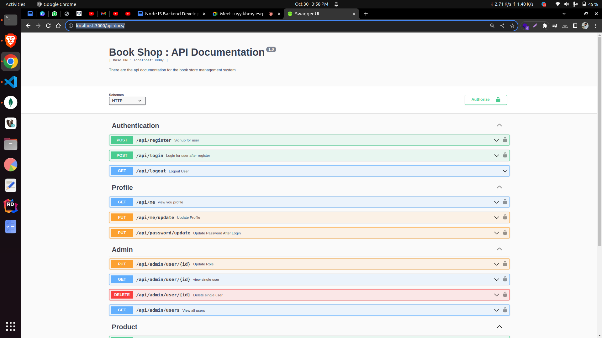

# Book_Store_NodeJS
Objective: Develop a RESTful API using Node.js for managing books.

# Start Project

1.  Install packages using,
    npm install
2.  Add details in "config/config.env" file
3.  Run using this command,
    npm start
4.  open in browser for this url "localhost:3000/api-docs"

---

# Project Setup

1.  Nodejs Express RestAPI
2.  Swagger Api Documentation for Testing api
3.  MongoDB (Database using mongoose ODM)

---

# Functionalities

<!-- Authentication -->
1.  Register
2.  Login
3.  Forgot password (send link in email)
4.  Logout
<!-- User -->
5.  view profile
6.  update profile
7.  update password or change password
8.  update role >> admin
9.  view all users >> admin
10. view single users >> admin
11. delete user >>admin
<!-- Product -->
12. add product
13. all products
14. product details
15. update product
16. delete product

---

# Api Details

Api documentation url => 

localhost:3000/api-docs

browse the url => localhost:3000/api-docs
then we can view the below screen, it was the comple api documentation for this project.

